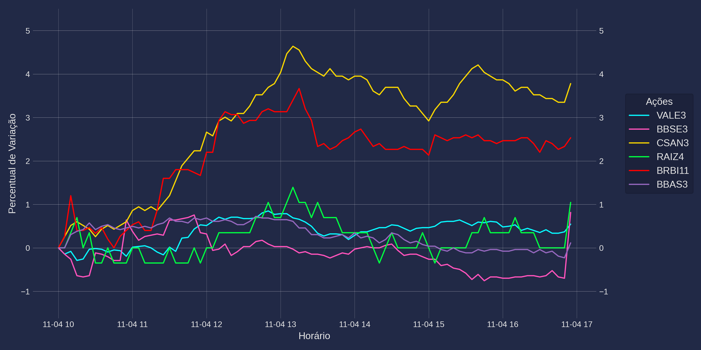

# Market-Mail

Este projeto consiste em criar um sistema simples sobre ações brasileiras.
O sistema terá um site onde os usuários poderão inserir seu e-mail e confirmar o registro. 
Depois disso, eles poderão selecionar as ações que querem acompanhar.
Diariamente, o sistema enviará por e-mail a variação dessas ações junto com um gráfico simples.

## Exemplo:

Variação das ações selecionadas:

RANI3:  7.67  | +4.78% ▲

CSAN3:  12.08 | +3.78% ▲

BRBI11: 15.38 | +2.53% ▲

TRPL4:  24.60 | +1.44% ▲

RAIZ4:  2.90  | +1.05% ▲

BBSE3:  34.64 | +0.81% ▲

VALE3:  62.67 | +0.55% ▲

TAEE11: 34.95 | +0.46% ▲

BBAS3:  26.24 | +0.11% ▲

SAPR4:  5.34  | -0.37% ▼

SAPR11: 26.27 | -0.49% ▼

Atualizado: 2024-11-04 16:55:00-03:00
